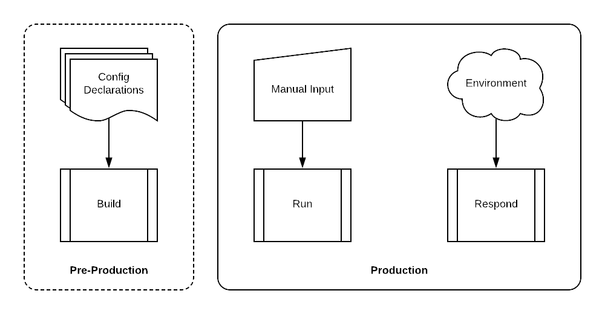

============
Introduction
============

Automation Overview
-------------------

This training workshop provides hands-on exposure to the three primary
categories of infrastructure automation activities: **Build**, **Run**, and
**Respond**.

Build
    Build automation is the means by which a set of infrastructure elements are
    declared, instantiated, and orchestrated using automation tools and
    infrastructure APIs.  The result is a set of deployed infrastructure
    elements that are in production (or production-ready) with a "day one"
    configuration.

Run
    Run automation encompasses any API-based configuration management actions
    that occur once the infrastructure element is in production.  These are
    primarily scheduled changes that are made to support new requirements.  The
    input to these changes is manually defined in a variety of formats such as
    YAML, JSON, XML, etc.

Respond
    Response automation includes any automated actions that are triggered by an
    event.  These may be operational events such as changes to the
    infrastructure or security events such as of a new threat. Response actions
    are defined in advance but only initiated when a event matching its trigger
    criteria occurs.

Lab Topology
------------

.. figure:: topology.png

+--------------+--------------+-------------+
| Subnet       | Address      | Interface   |
+==============+==============+=============+
| Management   | 10.5.0.0/24  | Management  |
+--------------+--------------+-------------+
| Untrust      | 10.5.1.0/24  | ethernet1/1 |
+--------------+--------------+-------------+
| Web          | 10.5.2.0/24  | ethernet1/2 |
+--------------+--------------+-------------+
| Database     | 10.5.3.0/24  | ethernet1/3 |
+--------------+--------------+-------------+

Lab Components
--------------

Qwiklabs
    This lab is launched using Qwiklabs, which is an online learning platform
    that deploys and provides access to cloud-based lab environments.  Qwiklabs
    will establish a set of temporary set of credentials in the cloud provider
    in order to deploy and access the cloud infrastructure and services.

Launchpad VM
    A Debian 9 Linux virtual machine will be deployed in each cloud environment
    for you to use as your primary workspace for the lab activities,  This VM
    will be provisioned with all the tools and libraries necessary for
    deploying and managing infrastructure in the cloud provider.

Hashicorp Terraform
    Each cloud provider offers a mechanism that allow you to define a set of
    infrastructure element or services and orchestrate their instantiation.
    However, these tools and templates are specific to each cloud provider.
    We will be using Terraform to perform this function as it provides a
    common set of capabilities and a template formats acroos all cloud
    providers.

Red Hat Ansible
    Whereas Terraform excels at orchestrating deployment activities, Ansible is
    more effective at automating configuration management tasks.  We will be
    using both Terraform and Ansible to make configuration changes to the
    VM-Series firewall in order to illustrate their different capabilities.

Google Cloud Platform (GCP)
    Google Cloud Platform, offered by Google, is a suite of cloud computing
    services that runs on the same infrastructure that Google uses internally
    for its end-user products, such as Google Search and YouTube.

Amazon Web Services (AWS)
    Amazon Web Services is a subsidiary of Amazon that provides on-demand cloud
    computing platforms to individuals, companies and governments, on a metered
    pay-as-you-go basis.
