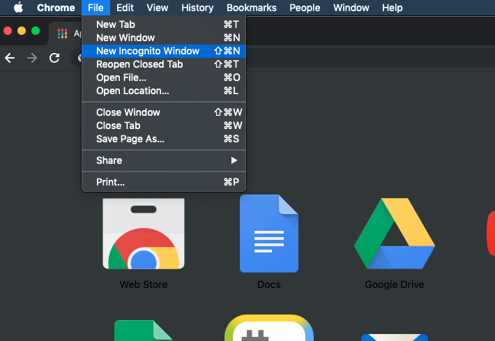
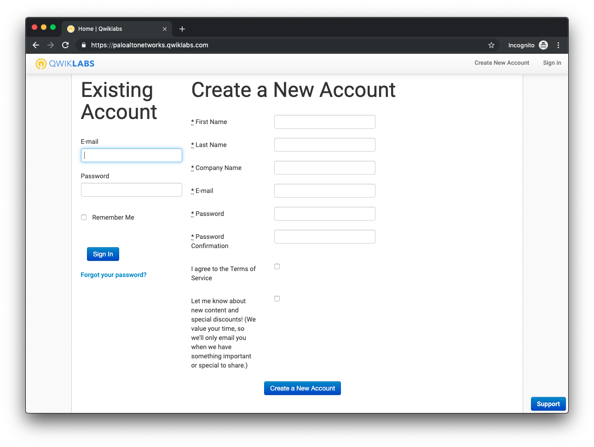
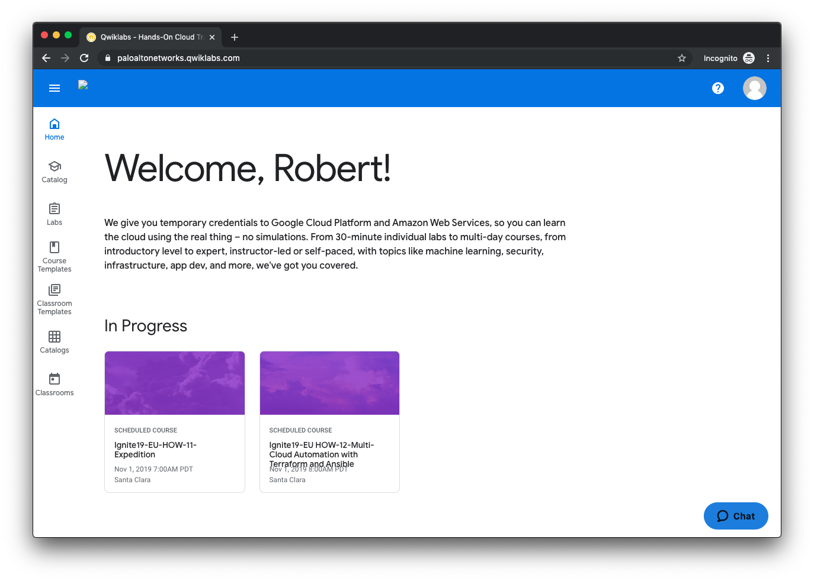
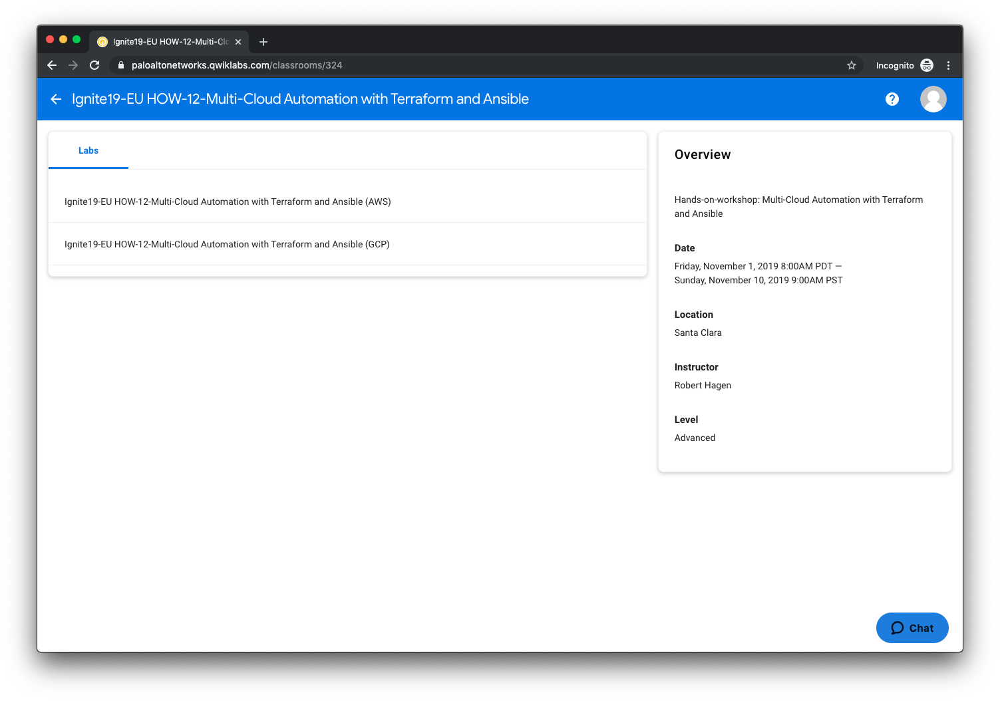
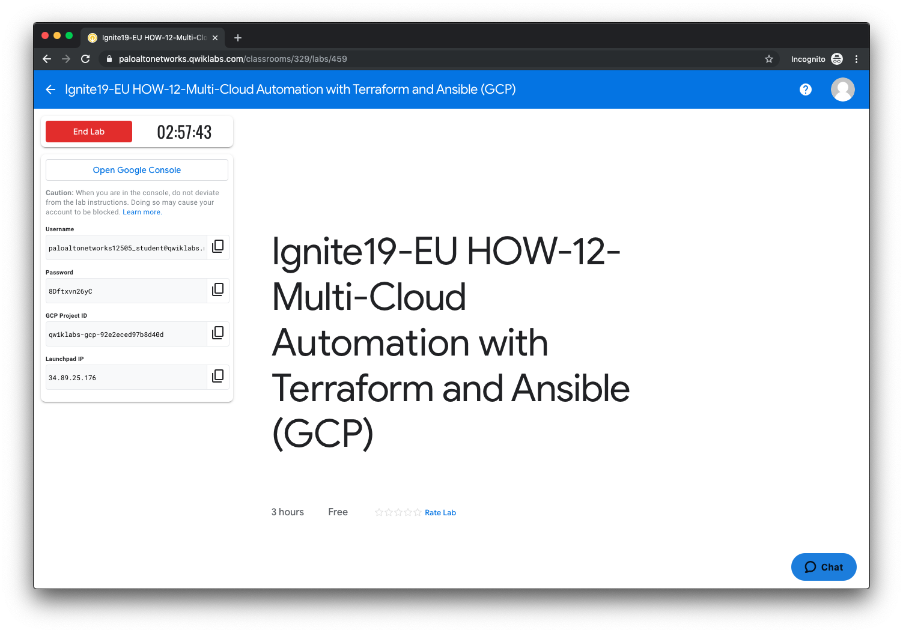
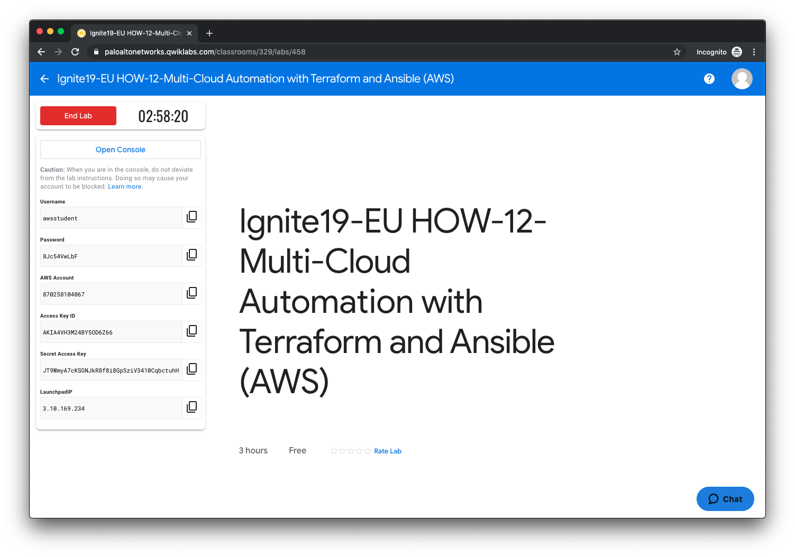

=================
Setup
=================

In this activity you will:

- Log into the Qwiklabs portal
- Launch the GCP or AWS Lab
- SSH into the Launchpad VM
- Clone the lab software repository

.. warning:: Before you start it is recommended that you launch a private instance
          of your web browser.  This will prevent the use of cached Google or
          Amazon credentials if you log into the GCP or AWS consoles.  This
          will help ensure you do not incur any personal charges within these
          cloud providers.

    Chrome Incognito mode

Log into the Qwiklabs portal
----------------------------

Navigate to the `Qwiklabs URL <https://paloaltonetworks.qwiklabs.com>`_ in your
web browser.

``https://paloaltonetworks.qwiklabs.com``

Log in with your Qwiklabs credentials (sign up if you are new to Qwiklabs). You
must use your corporate email address for the username.

Launch the lab environment
--------------------------
Confirm that the course containing the phrase *"Multi-Cloud Automation"* is
listed under In Progress on the welcome screen.  Click on the this course in
order to add it to your My Learning inventory.

You will be presented with two lab environments within this course: one for GCP
and the other for AWS.  You may choose either one depending on your learning
objectives or platform familiarity.

.. note:: If you finish all the activities for one lab environment, you are
          free to launch the other (time permitting).  The lab activities are
          similar, but there are instructions specific to each cloud provider.

Once you've selected the lab evironment, you will need to click the
**Start Lab** button.  Qwiklabs will then provision a set of account
credentials and instantiate a "launchpad" virtual machine that you will SSH
into to perform the rest of the lab activities.

    Provisioning the GCP lab environment

    Provisioning the AWS lab environment

Each lab environment will take a few minutes to provision and deploy the
Launchpad VM.  Once it is completed, a **Launchpad IP** field will be added to
the bottom left panel.

SSH into the Launchpad VM
-------------------------
Once the lab environment has completed the provisioning process and the
**Launchpad IP** field is displayed, you may SSH into that IP address using the
following credentials.

- **Username:** ``student``
- **Password:** ``Ignite2019!``

Clone the lab software repository
---------------------------------
Once you have successfully logged into the Launchpad VM you will need to clone
the GitHub repository used in this lab.  This repository (or *repo*) contains
the files needed to deploy the network and compute infrastructure we'll be
working with.

.. code-block:: bash

    $ git clone https://github.com/PaloAltoNetworks/multicloud-automation-lab.git

You are now ready to deploy the lab infrastructure.

