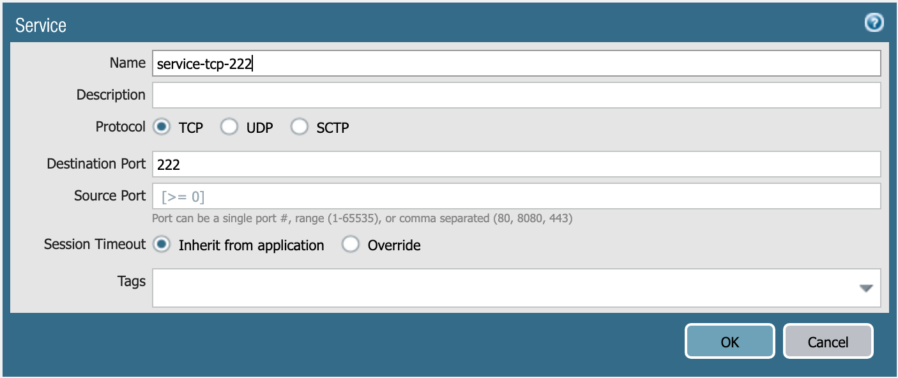
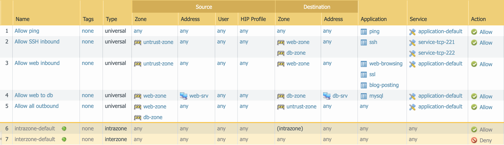
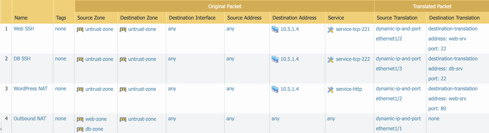

=====================
Ansible Configuration
=====================

In this activity you will:

- Define Module Communications
- Define Address Objects
- Define Service Objects
- Define Security Rules
- Define NAT Rules
- Commit the Configuration
- Run the Playbook

For this portion of the lab, you're going to be using the Palo Alto Networks
`Ansible modules <https://ansible-pan.readthedocs.io/en/latest/>`_.

First, let's change to the Ansible configuration directory.

.. code-block:: bash

  $ cd ~/multicloud-automation-lab/configuration/ansible

Module Communications
---------------------

Just like with Terraform, your first task is setting up the communication with
the firewall.  The IP address, username, and password (or API key) can be set
as variables or specified on the command line.  However, since we've already
got them as environment variables, we can just read them in.

The ``vars.yml`` file contains the following:

.. code-block:: yaml

    provider:
      ip_address: "{{ lookup('env', 'PANOS_HOSTNAME') }}"
      username: "{{ lookup('env', 'PANOS_USERNAME') }}"
      password: "{{ lookup('env', 'PANOS_PASSWORD') }}"

This code simply reads the content of the environment variables we set in the
Terraform portion into the dictionary ``provider``.  This is then referenced by
our playbook file, ``playbook.yml``.

Similar to the Terraform portion of the lab, our firewall doesn't have any
objects or rules configured.  We're going to implement that with an Ansible
playbook.

.. note:: You wouldn't actually change tools in the middle of configuration
   like we're doing here.  We just want you to get exposure to both tools and see
   that you can accomplish the same tasks with either one.

Address Objects
---------------

Open the ``playbook.yml`` file in your text editor.  It will contain the following:

.. code-block:: yaml

    ---
    - hosts: localhost
      connection: local
      gather_facts: false

    vars_files:
      - vars.yml

    roles:
      - PaloAltoNetworks.paloaltonetworks

    tasks:
      - name: Create web server object
        panos_address_object:
          provider: "{{ provider }}"
          name: "web-srv"
          value: "10.5.2.5"
          commit: False
          state: present

      - name: Create DB server object
        panos_address_object:
          provider: "{{ provider }}"
          name: "db-srv"
          value: "10.5.3.5"
          commit: False
          state: present

This playbook creates the following address objects by using the
`panos_address_object module <https://ansible-pan.readthedocs.io/en/latest/modules/panos_address_object_module.html>`_.
Also notice the fact that ``commit`` is set to **False**, so that we don't have
to wait on a commit each time a module runs.

Service Objects
---------------

Next, create some service objects.  We want to allow SSH on some non-standard
ports so we can easily communicate with web and DB servers behind our firewall.
You'll need to refer to the
`panos_service_object module <https://ansible-pan.readthedocs.io/en/latest/modules/panos_service_object_module.html>`_
documentation.

The example code for that module looks like this:

.. code-block:: yaml

    - name: Create service object 'ssh-tcp-22'
      panos_service_object:
        provider: '{{ provider }}'
        name: 'ssh-tcp-22'
        destination_port: '22'
        description: 'SSH on tcp/22'

Use the ``panos_service_object`` module to create two objects with the
following definitions:

   **service-tcp-221** service object.

   **service-tcp-222** service object.

Security Rules
--------------

Now we need to create security rules to allow traffic.  You'll need to refer to
the `panos_security_rule module <https://ansible-pan.readthedocs.io/en/latest/modules/panos_security_rule_module.html>`_
documentation.

The example code for that module looks like this:

.. code-block:: yaml

    - name: add SSH inbound
      panos_security_rule:
        provider: '{{ provider }}'
        rule_name: 'SSH permit'
        description: 'SSH rule test'
        source_zone: ['public']
        source_ip: ['any']
        destination_zone: ['private']
        destination_ip: ['1.1.1.1']
        application: ['ssh']
        action: 'allow'

Use the ``panos_security_rule`` module to create the following security rules:

   Security rules to be created.

NAT Rules
---------

Now we need to create the required NAT rules.  You'll need to refer to the
`panos_nat_rule module <https://ansible-pan.readthedocs.io/en/latest/modules/panos_nat_rule_module.html>`_
documentation.

The example code for that module looks like this:

.. code-block:: yaml

    - name: Create NAT SSH rule for 10.0.1.101
      panos_nat_rule:
        provider: '{{ provider }}'
        rule_name: "Web SSH"
        source_zone: ["external"]
        destination_zone: "external"
        source_ip: ["any"]
        destination_ip: ["10.0.0.100"]
        service: "service-tcp-221"
        snat_type: "dynamic-ip-and-port"
        snat_interface: "ethernet1/2"
        dnat_address: "10.0.1.101"
        dnat_port: "22"

Use the ``panos_nat_rule`` module to create the following NAT rules:

   NAT rules to be created.

.. note:: Pay attention to the module arguments for ``panos_nat_rule``.  **destination_zone**
          and **service** are strings here, not lists.  This is because you can't
          write a NAT rule on PAN-OS with multiple destination zones or services.

Commit the Configuration
------------------------

If you have been writing your playbook with ``commit`` set to **False** each
time, you have an uncommitted candidate configuration.  There's a panos_commit
module to perform a commit.

The example code for the module should do what you need:

.. code-block:: yaml

  - name: commit candidate config on firewall
    panos_commit:
      provider: '{{ provider }}'

Run the Playbook
----------------

Save and exit your ``playbook.yml`` file.  Then run your playbook with the
following command:

.. code-block:: bash

   $ ansible-playbook -i inventory playbook.yml

Log in to the web UI of the firewall, and verify that the configuration matches
what you want.  If you get errors, indentation is most likely the problem.
Ansible is very particular about lines being indented with spaces and not with
tabs.

You're now done with the Ansible portion of the lab!
