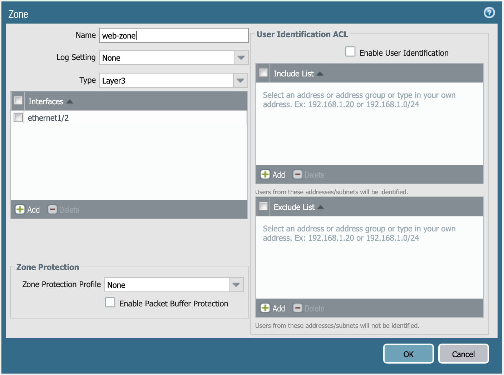

=======================
Terraform Configuration
=======================

In this activity you will:

- Initialize the Provider
- Configure Network Interfaces 
- Configure Virtual Router 
- Configure Security Zones 

For this portion of the lab, you will be using the Palo Alto Networks
`Terraform for PAN-OS provider <https://www.terraform.io/docs/providers/panos/index.html>`_.

First, change to the Terraform configuration directory.

.. code-block:: bash

    $ cd ~/multicloud-automation-lab/configuration/terraform

Provider Initialization
-----------------------
Your first task is to set up the communications between the provider and your
lab firewall.  There's several ways this can be done.  The IP address,
username, and password (or API key) can be set as variables in Terraform, and
can be typed in manually each time the Terraform plan is run, or specified on
the command line using the ``-var`` command line option to ``terraform plan``
and ``terraform apply``.  You can also reference a JSON file in the provider
configuration which can contain the configuration.

Another way you can accomplish this is by using environment variables.  Use the
following commands to add the appropriate environment variables:

.. code-block:: bash

    $ export PANOS_HOSTNAME="<YOUR FIREWALL MGMT IP GOES HERE>"
    $ export PANOS_USERNAME="admin"
    $ export PANOS_PASSWORD="Ignite2019!"

.. note:: Replace the text ``<YOUR FIREWALL MGMT IP GOES HERE>`` with your firewall's management IP address.

Now, you should see the variables exported in your shell, which you can verify
using the ``env | grep PANOS`` command:

.. code-block:: bash

    PANOS_HOSTNAME=3.216.53.203
    PANOS_USERNAME=admin
    PANOS_PASSWORD=Ignite2019!

With these values defined, we can now initialize the Terraform panos provider with the following command.

.. code-block:: bash

    $ terraform init

The provider is now ready to communicate with our firewall.

Network Interfaces
------------------
Your firewall has been bootstrapped with an initial password and nothing else.
We're going to be performing the initial networking configuration with
Terraform.

You've been provided with the following Terraform plan in ``main.tf``:

.. code-block:: terraform

    provider "panos" {}

    resource "panos_ethernet_interface" "untrust" {
        name                      = "ethernet1/1"
        vsys                      = "vsys1"
        mode                      = "layer3"
        enable_dhcp               = true
        create_dhcp_default_route = true
    }

    resource "panos_ethernet_interface" "web" {
        name        = "ethernet1/2"
        vsys        = "vsys1"
        mode        = "layer3"
        enable_dhcp = true
    }

    resource "panos_ethernet_interface" "db" {
        name        = "ethernet1/3"
        vsys        = "vsys1"
        mode        = "layer3"
        enable_dhcp = true
    }

This configuration creates your network interfaces.  The PAN-OS provider
doesn't need any additional configuration specified because it is pulling that
information from the environment variables we set earlier.

Now, you can run ``terraform apply``, and the interfaces will be created on the
firewall.

Virtual Router
--------------
Now, you'll have to assign those interfaces to the default virtual router.
You will need the
`panos_virtual_router <https://www.terraform.io/docs/providers/panos/r/virtual_router.html>`_
resource.

The example code from that page looks like this:

.. code-block:: terraform

    resource "panos_virtual_router" "example" {
        name = "my virtual router"
        static_dist = 15
        interfaces = ["ethernet1/1", "ethernet1/2"]
    }

Your version will be similar, but it should have the following definition:

.. figure:: vr.png

   Virtual router **default**.

Specifying the static distance isn't required.

Define the virtual router resource in ``main.tf``, and run ``terraform apply``.

.. warning:: AWS and GCP have slight differences in the way that routing has to
   be configured.  **If you chose GCP as your cloud, you have an additional
   step!**

   If you chose AWS, please continue to `Security Zones <#security-zones>`_ section and skip the following.

GCP requires static routes for each subnet to be defined on the virtual router.
You will need the `panos_static_route_ipv4 <https://www.terraform.io/docs/providers/panos/r/static_route_ipv4.html>`_
resource.

The example code from that page looks like this:

.. code-block:: terraform

    resource "panos_static_route_ipv4" "example" {
        name = "localnet"
        virtual_router = "${panos_virtual_router.vr1.name}"
        destination = "10.1.7.0/32"
        next_hop = "10.1.7.4"
    }

    resource "panos_virtual_router" "vr1" {
        name = "my virtual router"
    }

This code adds a static route named *localnet*, that routes traffic destined to
the network *10.1.7.0/32* to the next hop of *10.1.7.4*.

You will need to create three resources for the static routes depicted below:

   Static routes needed in GCP.

Define those resources in ``main.tf``, and run ``terraform apply``.

Security Zones
--------------
Next is creating the security zones for the firewall.  You will need the
`panos_zone <https://www.terraform.io/docs/providers/panos/r/zone.html>`_ resource.

The example code from that page looks like this:

.. code-block:: terraform

    resource "panos_zone" "example" {
        name = "myZone"
        mode = "layer3"
        interfaces = ["${panos_ethernet_interface.e1.name}", "${panos_ethernet_interface.e5.name}"]
        enable_user_id = true
        exclude_acls = ["192.168.0.0/16"]
    }

    resource "panos_ethernet_interface" "e1" {
        name = "ethernet1/1"
        mode = "layer3"
    }

    resource "panos_ethernet_interface" "e5" {
        name = "ethernet1/5"
        mode = "layer3"
    }

You need to create three security zones (similar to ``e1`` or ``e5`` in this example),
but they need to have the following definition:

   Definition of **untrust-zone**.

   Definition of **web-zone**.

   Definition of **db-zone**.

Define those resources in ``main.tf``, and run ``terraform apply``.

You're done with the Terraform portion of the lab!
