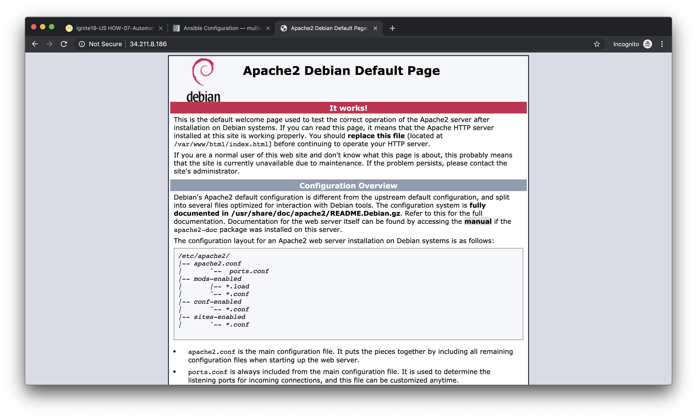
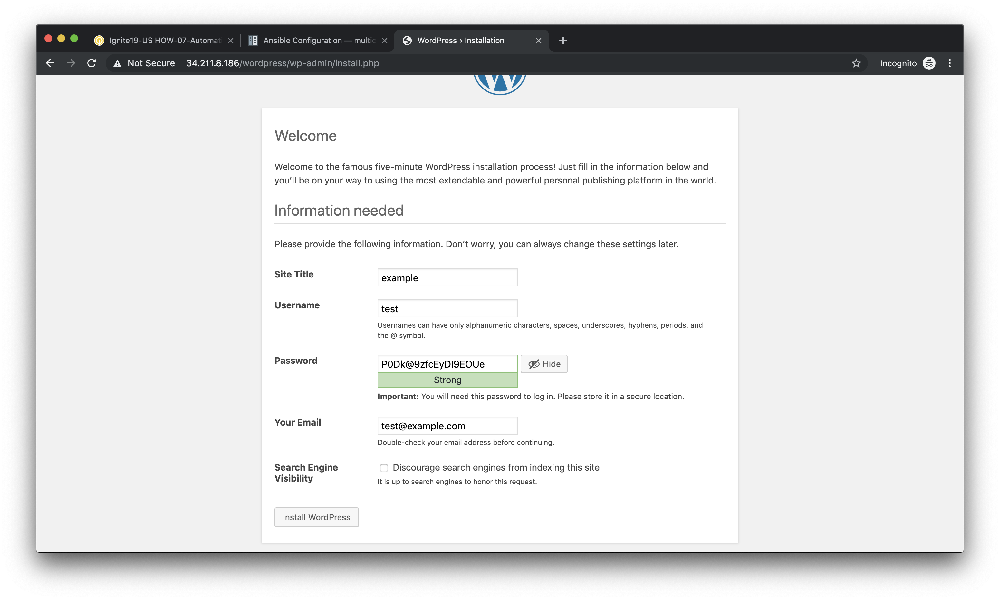
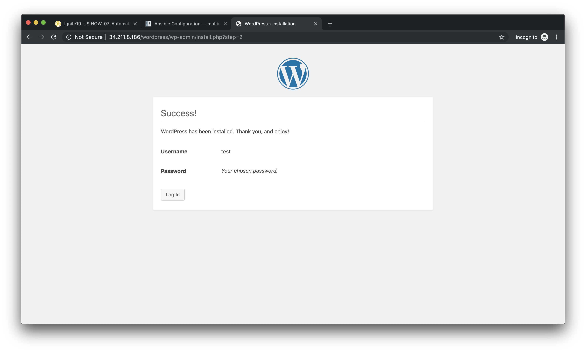
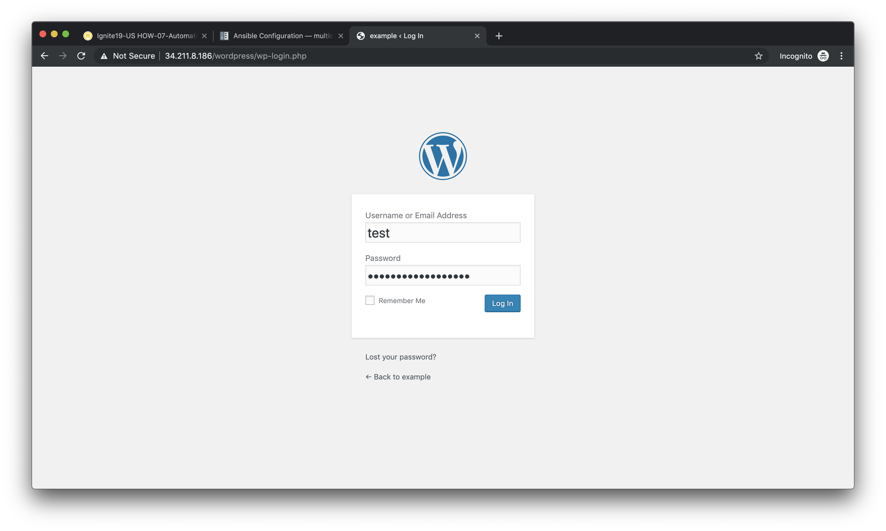
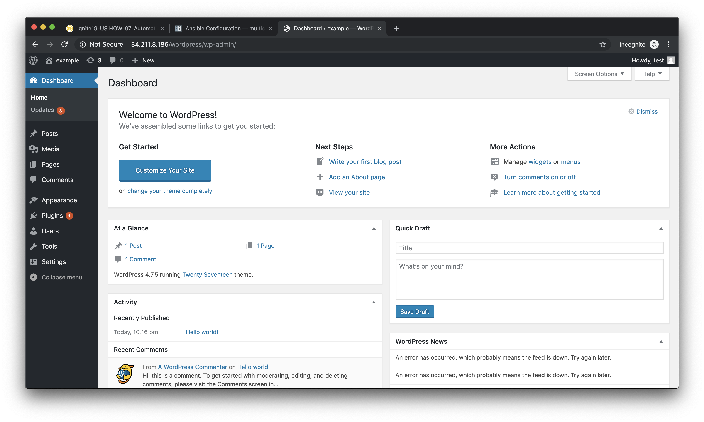
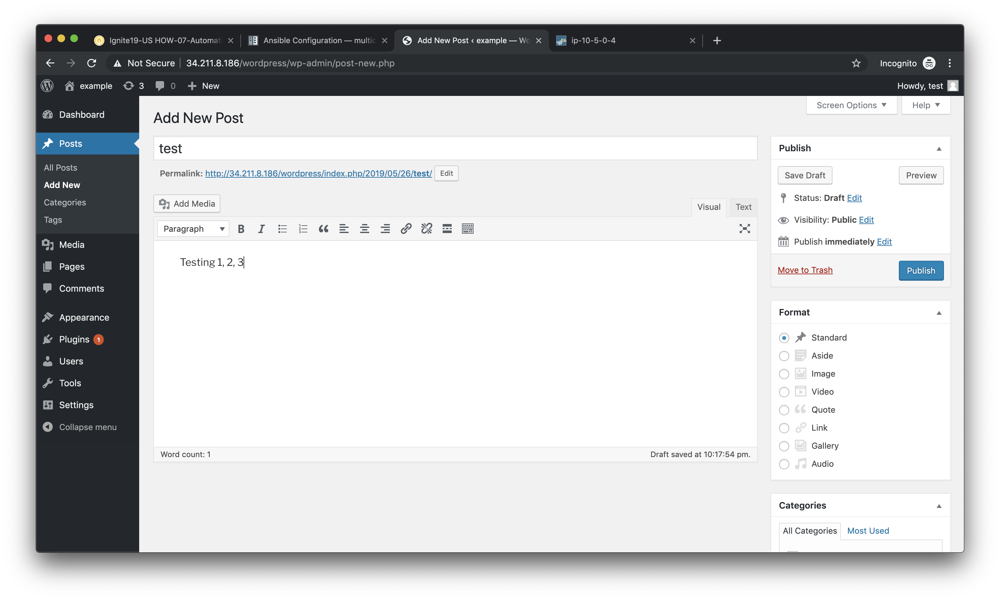
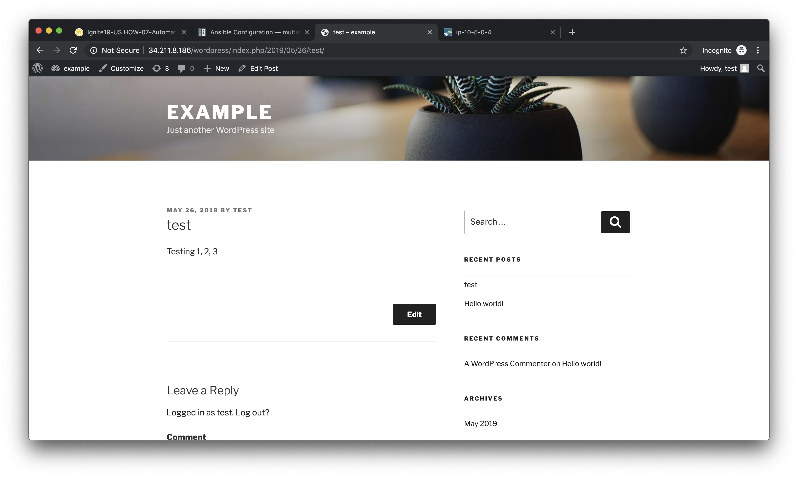
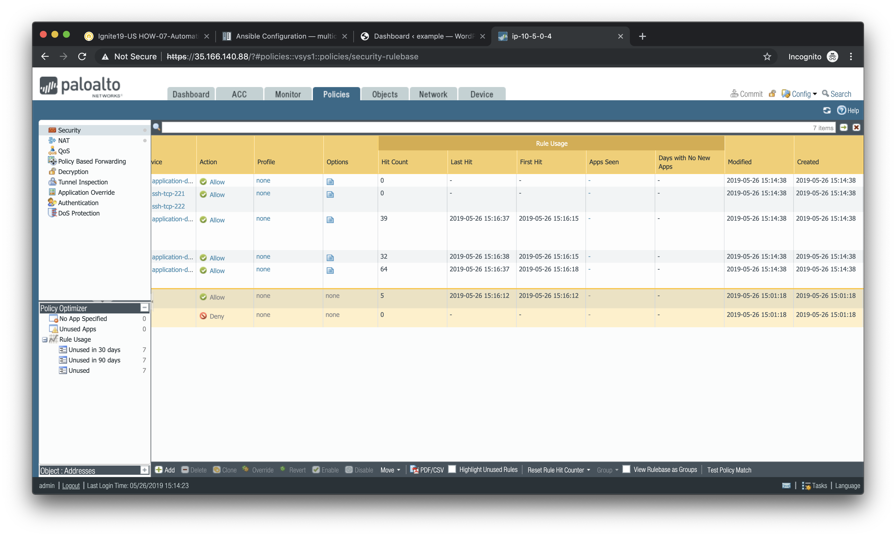
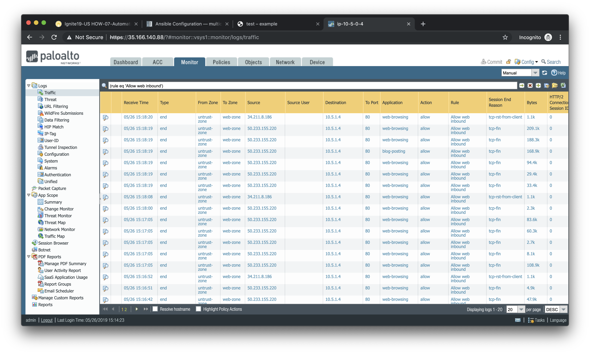
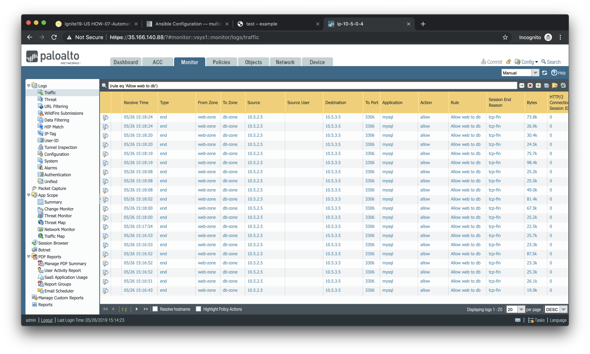

==================
Validation Testing
==================

In this activity you will:

- Access the Apache web server
- Access the WordPress application
- Post a blog article
- Verify firewall rule matches

The previous two activities had you deploy and configure the infrastructure
supporting our WordPress application.  Now it's time to see if everything
works as planned.  If so, you should be able to access the application, post
a blog article, and verify that the appropriate firewall rules are being hit.
If not, you will need to troubleshoot your configs and make the necessary
corrections.

Access the Apache web server
----------------------------
The web server is using the firewall's untrust interface address in a
destination NAT rule.  Run the following commands to determine the IP
address of this interface.

`For GCP:`

.. code-block:: bash

    $ cd ~/multicloud-automation-lab/deployment/gcp
    $ terraform output

`For AWS:`

.. code-block:: bash

    $ cd ~/multicloud-automation-lab/deployment/aws
    $ terraform output

Open a new tab in your web browser and go to ``http://<web-server-ip-address>``.
You should see the Apache default home page.

Access the WordPress application
--------------------------------
Append ``/wordpress`` to the end of the web server URL and the WordPress
installation page should be displayed.

Fill in values of your choosing for the **Site Name**, **Username**, and
**Your Email**.  These are only for testing and do not need to be real values.

.. note:: Make sure you copy the password that is provided to your clipboard.
    Otherwise you may not be able to log in once WordPress is installed.

Click **Install WordPress** when you are done.

On the following page, click on **Log In** to log into the WordPress
administrator dashboard.

Log into WordPress using the username and password you created.

You will then be presented with the WordPress administrator dashboard.

Post a blog article
-------------------
Now that you've successfully logged into the WordPress administrator dashboard,
let's post an update to the blog.

Click on **Write your first blog post** under the **Next Steps** section.  You
will be presented with the **Add New Post** editor.

Enter a title for your post and some sample content.  Then click on **Publish**
to post the update.

You can then click on **Preview** to see the published blog update.

Verify firewall rule matches
----------------------------
Now that we've confirmed the WordPress application is working properly, let's
see what is happening with our firewall rules.

Log into the firewall administrator web interface at ``https://<firewall-management-ip>``
and navigate to **Policies > Security**.

If you scroll to the right you will see details on the security rules that are
being hit.

Scroll back to the left, find the security rule entitled *Allow web inbound*.
Then click on the drop-down menu icon to the right of the rule name and
select **Log Viewer*.

You will see all of the logs associated with inbound web traffic.  Notice the
applications identified are *web-browsing* and *blog-posting*.

.. note:: You may find source IPs other than your own as the web server is open
    to the public and will likely be discovered by web crawlers and other discovery
    tools aimed at public cloud providers.

Navigate back to **Policies > Security** and click on the **Log Viewer** for
the *Allow web to db* rule.

You will see all of the MySQL (actually MariaDB) database traffic between the
WordPress web server and the database backend.

