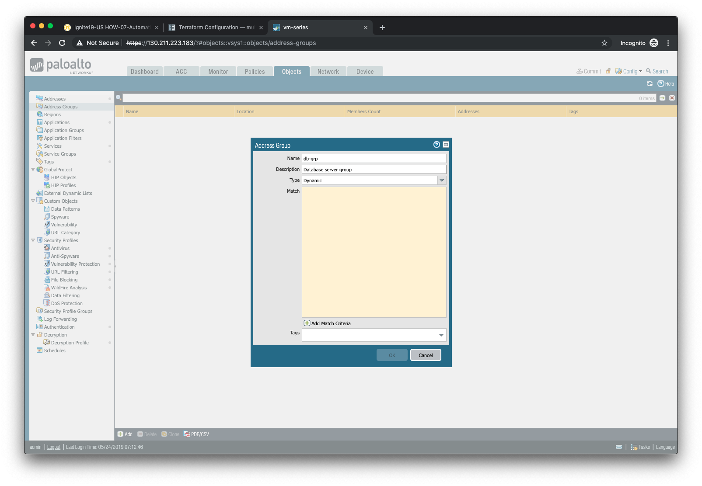
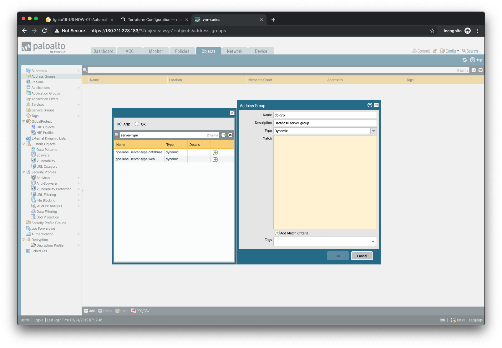
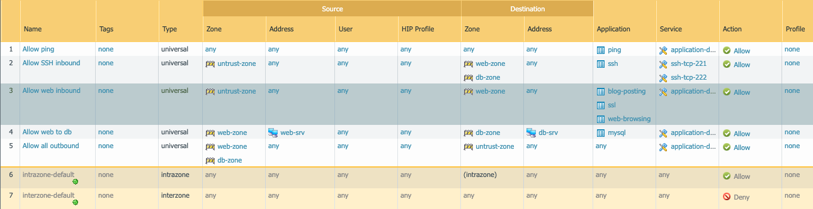

======================
Dynamic Address Groups
======================

In this activity you will:

- Create a Dynamic Address Group
- Define the attribute match criteria
- Apply the Dynamic Address Group to a rule

Dynamic Address Groups are policy object groups whose members are ephemeral in nature.  IP addresses are dynamically mapped to a Dynamic Address Group based on attribute match criteria.  These attributes are discovered from instances deployed in cloud environments and learned via cloud provider APIs.

Create a Dynamic Address Group
------------------------------
Navigate to **Objects > Address Groups** in the firewall web interface.

Click **Add** to create a new Dynamic Address Group.

In the **Address Group** window:

- Assign the name ``db-grp`` to the address groups.
- (optional) Provide a description of the address group.
- Select *Dynamic* from the **Type** drop-down menu.
- Click on **Add Match Criteria** to view the available attributes.

Define the attribute match criteria
-----------------------------------
The attributes displayed are discovered from the cloud provider API and are refreshed every *60 seconds*.  You will select the attributes that will need to be matched in order to associate a VM instance to your Dynamic Address Group.

Most of the attributes displayed are not needed.  However, each of the VM instances we've deployed have used a tag entitled ``server-type``.  Using the search bar at the top of the match criteria pop-up window, search for the term `server-type`.  Then add the result that has a value of ``database`` to the match criteria list.

Click **OK** when you are done.

Apply the Dynamic Address Group to a rule
------------------------------------------------
Now that we've defined a VM Information Source and a Dynamic Address Group, let's put them to use.  Navigate to **Policies > Security** in the firewall web interface.

Find the rule that allows *mysql* traffic from the ``web-srv`` address object in the ``web-zone`` to the ``db-srv`` address object in the ``db-zone``.

Replace the ``db-srv`` destination with the ``db-grp`` Dynamic Address Group you've created.

Click **OK** and then commit your changes by clicking **Commit**.
