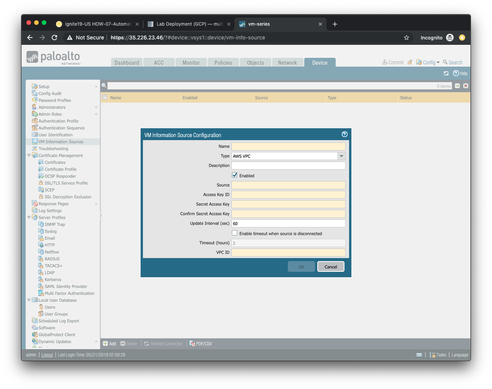
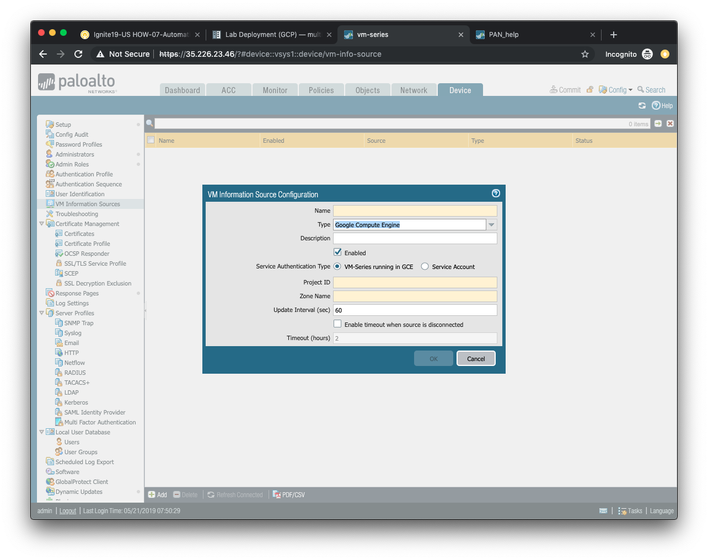

===================
Cloud Monitoring
===================

In this activity you will:

- Create a VM Information Sources profile (AWS or GCP)
- Create a Dynamic Address Group
- Update a security rule with the DAG

The automation tasks we've accomplished thus far have focused on deploying the VM-Series firewall and making changes to it externally via the API.  We'll now shift our focus to how PAN-OS can leverage third-party APIs to monitor its environment and respond to changes it observes.

Create a VM Information Sources (AWS)
------------------------------------------------
We will be creating a VM Information Source on the firewall to monitor the AWS EC2 environment for meta-data about the running VM instances.  Open a web browser and go to ``https://<your-firewall-ip>``.  You will log in with the following credentials.

- **Username:** ``admin``
- **Password:** ``Ignite2019!``

Once you have logged into the firewall, go to the **VM Information Sources** under the **Device** tab and click **Add**.

- Provide a name for your monitored source in the **Name** field.

- (optional) Provide a description of the monitored source in the **Description** field.

- Ensure that *AWS VPC* is selected from the **Type** field selection.

- Ensure that the **Enabled** button is selected.

- The **Source** field will contain the URI of the AWS region in which the lab is deployed.  The format for this is *ec2.<your_AWS_region>.amazonaws.com*. For example, if the region is *us-west-2* then the URI will be *ec2.us-west-2.amazonaws.com*.

- The **Access Key ID** field will contain the Access Key ID provided in the Qwiklabs portal.

- The **Secret Access Key** field (and confirmation field) will contain the Secret Access Key provided in the Qwiklabs portal.

- The **Update Interval**, and timeout fields can keep their default values.

- The **VPC ID** field will contain the AWS VPC value that was output during the deployment phase.  You can change into the AWS deployment directory and display the Terraform output values with the following command.

.. code-block::

    $ terraform output

Click **OK** and commit the configuration on the firewall.

Create a VM Information Sources (GCP)
------------------------------------------------
We will be creating a VM Information Source on the firewall to monitor the GCP Compute Engine environment for meta-data about the running VM instances.  Open a web browser and go to ``https://<your-firewall-ip>``.  You will log in with the following credentials.

- **Username:** ``admin``
- **Password:** ``Ignite2019!``

Once you have logged into the firewall, go to the **VM Information Sources** under the **Device** tab and click **Add**.

- Provide a name for your monitored source in the **Name** field.

- Ensure that *Google Compute Engine* is selected from the **Type** field selection.

- (optional) Provide a description of the monitored source in the **Description** field.

- Ensure that the **Enabled** button is selected.

- Select *VM-Series running in GCE* from the **Service Authorization Type** selector.

- The **Project ID** field will contain the Access Key ID provided in the Qwiklabs portal.

- The **Zone Name** field will contain the GCP zone in which the lab has been deployed.

- The **Update Interval**, and timeout fields can keep their default values.

Click **OK** and commit the configuration on the firewall.