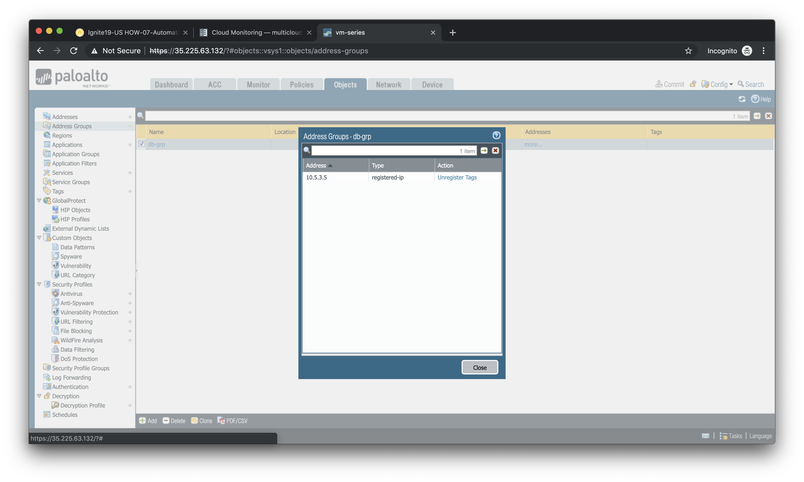
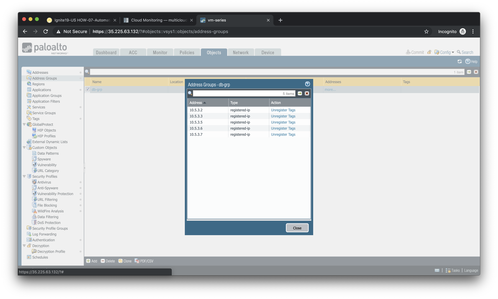

===============
Compute Scaling
===============

In this activity you will:

- Determine Dynamic Address Group membership
- Scale out the database instances
- Confirm Dynamic Address Group changes

The combination of VM Information Sources and Dynamic Address Groups allows the firewall to respond to changes made to the cloud environment.  In this lab scenario you will scale out the number of database instances used to support the web application.  This should result in the automatic update of the Dynamic Address Group membership.

Determine Dynamic Address Group membership
------------------------------------------
First, we should confirm that the one database instance we've already deployed has already been mapped to the Dynamic Address Group based on it's ``server-type`` attribute.

Navigate to **Objects > Address Groups** in the firewall web interface and select the Dynamic Address Group ``db-grp`` that you previously created.

Under the *Addresses* column, click on the link entitled ``more...``

You should see the IP address ``10.5.3.5``, which is the IP address of the existing database instance.

Click **Close** to close the pop-up window.

Scale out the database instances
--------------------------------
To scale out the number of database instances we'll go back to our Terraform deployment.

For GCP:

.. code-block:: bash

    $ cd ~/multicloud-automation-lab/deployment/gcp

For AWS:

.. code-block:: bash

    $ cd ~/multicloud-automation-lab/deployment/aws

In the ``main.tf`` file there is a module called ``scale`` that is commented out.  Open ``main.tf`` in a text editor and uncomment that entire section.  

Save the file and exit.

By uncommenting the ``scale`` module you have just added a new module to the Terraform plan.  This will require a re-initialization of the plan.

.. code-block:: bash

    $ terraform init

You can now apply the Terraform plan.

.. code-block:: bash

    $ terraform apply

This will result in four new database instances being added to the database subnet.

Confirm Dynamic Address Group changes
-------------------------------------
Now go back to the **Objects > Address Groups** section of the firewall web interface and click ``more...`` under the **Addresses** column of the ``db-grp`` entry.

You should now see a total of five IP addresses as members of the ``db-grp`` Dynamic Address Group.  These are now part of the destination match criteria for the databaase security rule.

.. note:: Remember that the VM Information Source is polling the cloud provider API every *60 seconds*.  If you do not see a total of five IP addresses in the Dynamic Address Group, close the window and click on ``more...`` again after a few moments.

