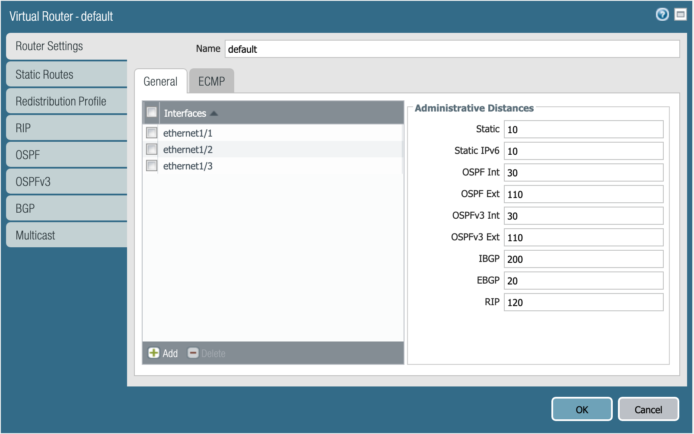

======================
Activity 1 - Terraform
======================

For this portion of the lab, you will be using the Palo Alto Networks
`Terraform provider <https://www.terraform.io/docs/providers/panos/index.html>`_.

First, change to the ``activities/01-terraform`` directory.

Task 1.1 - Provider Communication
=================================

Your first task is to set up the communication between the provider and your
lab firewall.  There's several ways this can be done.  The IP address,
username, and password (or API key) can be set as variables in Terraform, and
can be typed in manually each time the Terraform plan is run, or specified on
the command line using the ``-var`` command line option to ``terraform plan``
and ``terraform apply``.  You can also reference a JSON file in the provider
configuration which can contain the configuration.

Another way you can accomplish this is by using environment variables.  Edit
the file ``envvars.sh`` with your text editor:

.. code-block:: bash

    #!/bin/sh

    export PANOS_HOSTNAME="<YOUR FIREWALL IP ADDRESS GOES HERE>"
    export PANOS_USERNAME="admin"
    export PANOS_PASSWORD="Ignite2019!"

Replace the text ``<YOUR FIREWALL IP ADDRESS GOES HERE>`` with your firewall's
management IP address.  The username and password should still be valid if you
haven't changed the bootstrap configuration.  Save the file, and export the
variables by running the following command:

.. code-block:: bash

    source envvars.sh

Now, you should see the variables exported in your shell, which you can verify
using the ``env`` command:

.. code-block:: bash

    ...
    PANOS_HOSTNAME=3.216.53.203
    PANOS_USERNAME=admin
    PANOS_PASSWORD=Ignite2019!
    ...

They may not necessarily be in order, and you will see a lot of other
environment variables as well, so you may have to hunt a little bit.

The provider is now ready to communicate with our firewall.

Task 1.2 - Network Interface Configuration
==========================================

Your firewall has been bootstrapped with an initial password and nothing else.
We're going to be performing the initial networking configuration with
Terraform.

You've been provided with the following Terraform plan in ``main.tf``:

.. code-block:: terraform

    provider "panos" {}

    resource "panos_ethernet_interface" "eth1" {
        name                      = "ethernet1/1"
        vsys                      = "vsys1"
        mode                      = "layer3"
        enable_dhcp               = true
        create_dhcp_default_route = true
    }

    resource "panos_ethernet_interface" "eth2" {
        name        = "ethernet1/2"
        vsys        = "vsys1"
        mode        = "layer3"
        enable_dhcp = true
    }

    resource "panos_ethernet_interface" "eth3" {
        name        = "ethernet1/3"
        vsys        = "vsys1"
        mode        = "layer3"
        enable_dhcp = true
    }

This configuration creates your network interfaces.  The PAN-OS provider
doesn't need any additional configuration specified because it is pulling that
information from the environment variables we set earlier.

Now, you can run ``terraform apply``, and the interfaces will be created on the
firewall.

Task 1.3 - Virtual Router Configuration
=======================================

Now, you'll have to assign those interfaces to the default virtual router.
You will need the
`panos_virtual_router <https://www.terraform.io/docs/providers/panos/r/virtual_router.html>`_
resource.

The example code from that page looks like this:

.. code-block:: terraform

    resource "panos_virtual_router" "example" {
        name = "my virtual router"
        static_dist = 15
        interfaces = ["ethernet1/1", "ethernet1/2"]
    }

Your version will be similar, but it should have the following definition:

   Virtual router **default**.

Specifying the static distance isn't required.

Define the virtual router resource in ``main.tf``, and run ``terraform apply``.

.. warning:: AWS and GCP have slight differences in the way that routing has to
   be configured.  **If you chose GCP as your cloud, you have an additional
   step!**

   If you chose AWS, please continue on to **Task 1.4** and skip the following.

GCP requires static routes for each subnet to be defined on the virtual router.
You will need the `panos_static_route_ipv4 <https://www.terraform.io/docs/providers/panos/r/static_route_ipv4.html>`_
resource.

The example code from that page looks like this:

.. code-block:: terraform

    resource "panos_static_route_ipv4" "example" {
        name = "localnet"
        virtual_router = "${panos_virtual_router.vr1.name}"
        destination = "10.1.7.0/32"
        next_hop = "10.1.7.4"
    }

    resource "panos_virtual_router" "vr1" {
        name = "my virtual router"
    }

This code adds a static route named *localnet*, that routes traffic destined to
the network *10.1.7.0/32* to the next hop of *10.1.7.4*.

You will need to create three resources for the static routes depicted below:

   Static routes needed in GCP.

Define those resources in ``main.tf``, and run ``terraform apply``.

Task 1.4 - Zone Configuration
=============================

Next is creating the zones for the firewall.  You will need the
`panos_zone <https://www.terraform.io/docs/providers/panos/r/zone.html>`_ resource.

The example code from that page looks like this:

.. code-block:: terraform

    resource "panos_zone" "example" {
        name = "myZone"
        mode = "layer3"
        interfaces = ["${panos_ethernet_interface.e1.name}", "${panos_ethernet_interface.e5.name}"]
        enable_user_id = true
        exclude_acls = ["192.168.0.0/16"]
    }

    resource "panos_ethernet_interface" "e1" {
        name = "ethernet1/1"
        mode = "layer3"
    }

    resource "panos_ethernet_interface" "e5" {
        name = "ethernet1/5"
        mode = "layer3"
    }

You need to create three zones (similar to ``e1`` or ``e5`` in this example),
but they need to have the following definition:

.. figure:: untrust_zone.png

   Definition of **untrust-zone**.

.. figure:: web_zone.png

   Definition of **web-zone**.

.. figure:: db_zone.png

   Definition of **db-zone**.

Define those resources in ``main.tf``, and run ``terraform apply``.

Task 1.5 - Committing Your Configuration
========================================

One thing you have to remember when working with Terraform is it does not have
support for committing your configuration.  To commit your configuration, you
can use the following Go code, which has been provided for you in
``commit.go``:

.. code-block:: go

    package main

    import (
        "encoding/json"
        "flag"
        "log"
        "os"

        "github.com/PaloAltoNetworks/pango"
    )

    type Credentials struct {
        Hostname string `json:"hostname"`
        Username string `json:"username"`
        Password string `json:"password"`
        ApiKey string `json:"api_key"`
        Protocol string `json:"protocol"`
        Port uint `json:"port"`
        Timeout int `json:"timeout"`
    }

    func getCredentials(configFile, hostname, username, password, apiKey string) (Credentials) {
        var (
            config Credentials
            val string
            ok bool
        )

        // Auth from the config file.
        if configFile != "" {
            fd, err := os.Open(configFile)
            if err != nil {
                log.Fatalf("ERROR: %s", err)
            }
            defer fd.Close()

            dec := json.NewDecoder(fd)
            err = dec.Decode(&config)
            if err != nil {
                log.Fatalf("ERROR: %s", err)
            }
        }

        // Auth from env variables.
        if val, ok = os.LookupEnv("PANOS_HOSTNAME"); ok {
            config.Hostname = val
        }
        if val, ok = os.LookupEnv("PANOS_USERNAME"); ok {
            config.Username = val
        }
        if val, ok = os.LookupEnv("PANOS_PASSWORD"); ok {
            config.Password = val
        }
        if val, ok = os.LookupEnv("PANOS_API_KEY"); ok {
            config.ApiKey = val
        }

        // Auth from CLI args.
        if hostname != "" {
            config.Hostname = hostname
        }
        if username != "" {
            config.Username = username
        }
        if password != "" {
            config.Password = password
        }
        if apiKey != "" {
            config.ApiKey = apiKey
        }

        if config.Hostname == "" {
            log.Fatalf("ERROR: No hostname specified")
        } else if config.Username == "" && config.ApiKey == "" {
            log.Fatalf("ERROR: No username specified")
        } else if config.Password == "" && config.ApiKey == "" {
            log.Fatalf("ERROR: No password specified")
        }

        return config
    }

    func main() {
        var (
            err error
            configFile, hostname, username, password, apiKey string
            job uint
        )

        log.SetFlags(log.Ldate | log.Ltime | log.Lmicroseconds)

        flag.StringVar(&configFile, "config", "", "JSON config file with panos connection info")
        flag.StringVar(&hostname, "host", "", "PAN-OS hostname")
        flag.StringVar(&username, "user", "", "PAN-OS username")
        flag.StringVar(&password, "pass", "", "PAN-OS password")
        flag.StringVar(&apiKey, "key", "", "PAN-OS API key")
        flag.Parse()

        config := getCredentials(configFile, hostname, username, password, apiKey)

        fw := &pango.Firewall{Client: pango.Client{
            Hostname: config.Hostname,
            Username: config.Username,
            Password: config.Password,
            ApiKey: config.ApiKey,
            Protocol: config.Protocol,
            Port: config.Port,
            Timeout: config.Timeout,
            Logging: pango.LogOp | pango.LogAction,
        }}
        if err = fw.Initialize(); err != nil {
            log.Fatalf("Failed: %s", err)
        }

        job, err = fw.Commit(flag.Arg(0), true, true, false, true)
        if err != nil {
            log.Fatalf("Error in commit: %s", err)
        } else if job == 0 {
            log.Printf("No commit needed")
        } else {
            log.Printf("Committed config successfully")
        }
    }

This code reads the hostname, username, and password from the environment
variables we set earlier.  You can run it with ``go run commit.go``.
Additionally, you can add a commit comment with
``go run commit.go -c <your commit comment>``.

You're done with the Terraform portion of the lab!
